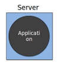
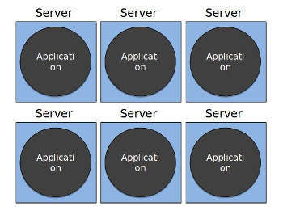
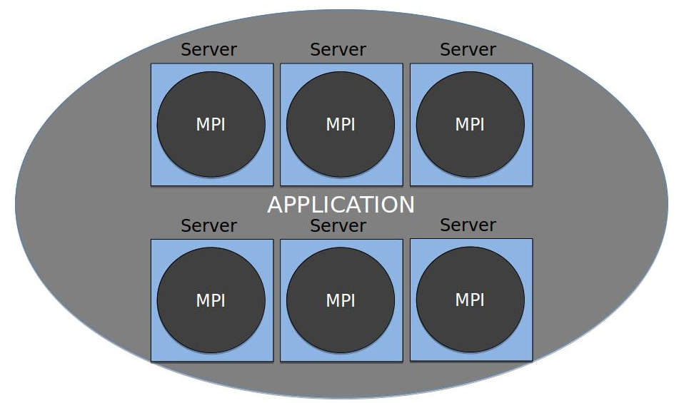

# Message passing interface

MPI, or message passing interface, is a language agnostic protocol that is used to program parallel computers and is used to facilitate communication adn synchronization across multiple systems.  Although not officially sanctioned by any major standards body, MPI has become the standard for process communication when running on a distributed memory system.  There are many implementations of this standard across multiple languages.  Most implementations combine C, C++ and assembly. Some languages that have MPI bindings to the C implementations include R, Perl, Ruby, python, fortran and java.

The power of MPI is that it provides a virtual topology which in simple terms, disolves the physical boundaries of machines.

 Laptops, desktops, and regular servers have a physical boundary even if you plug them into the internet.  Unless there are applications installed that can connect remotely with specific protocols, it cannot talk to or share data with lets say, the system that I am typing this on.

Even with the same application running on several other servers, there is still that physical boundry.  MPI softens those physical boundaries and allows the application to span multiple systems synchronizing and coordinating processes and memory.

